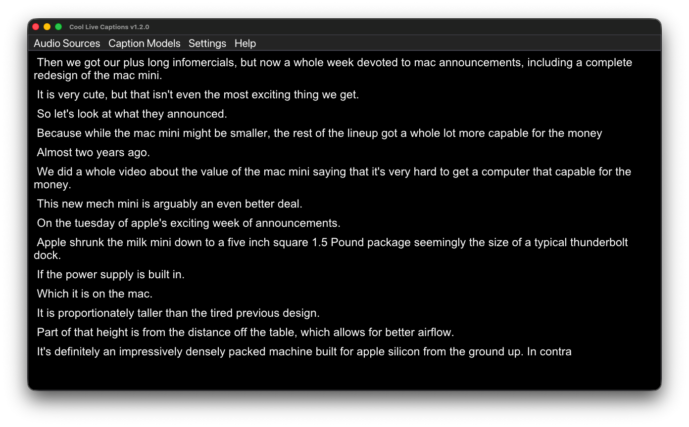

   

## Introduction

Cool Live Captions is a free and open source live caption desktop application that converts audio from your microphone or system audio to text in real-time. The speech recognition is powered by april-asr library with ONNX format. The model management allows you to download and switch between different models easily. All processed on-device using your CPU.

For FAQs and details, please see the [Wiki page](https://github.com/batterydie/cool-live-captions/wiki).

> Disclaimer: The captions may not be 100% accurate. Please do not rely on it for critical purposes.

## Screenshot

|  |  |  |
| --- | --- | --- |
| Windows 11 ([Full Image](assets/screenshot01.png)) | Linux GNOME ([Full Image](assets/screenshot02.png)) | macOS Tahoe ([Full Image](assets/screenshot03.png)) |

## OS Support

- Windows 10 or later via WASAPI (Tested on Windows 11, x86-64 only)
- Linux 6.x kernel or later via PipeWire (Tested on Debian 13/14 and Ubuntu 22.04/24.04 LTS, x86-64 only)
- macOS Sonoma 14.4 or later via AudioCore (Tested on macOS Tahoe, Apple Silicon only)

> Note: For macOS version, the Cool Live Captions app is not notarized/signed yet, so you may need to allow it in "System Settings > Security & Privacy" after launching for the first time.

## Quick Start

1. Download the [latest release](https://github.com/batterydie/cool-live-captions/releases) for your platform.
   a. For AppImage file, set executable permission via GUI or commandline before running.
2. Install and launch the Cool Live Captions.
3. The Cool Live Captions will ask you to download a model first, click "Yes".
4. Download and install a model from the list.
5. Once a model is loaded, the live captions will start immediately.

> Important: Our **own** models are under development and will be available soon. You can also use other models provided by abb128's april-asr: [https://abb128.github.io/april-asr/models.html](https://abb128.github.io/april-asr/models.html).

Any issue, please submit on the [GitHub Issues page](https://github.com/batterydie/cool-live-captions/issues).

## Acknowledgements

This project makes use of a few libraries:

- [april-asr](https://github.com/abb128/april-asr) - for on-device speech-to-text/speech recognition (License: GPL-3.0, © abb128 and contributors)
- [ONNX Runtime](https://onnxruntime.ai/) - for running ONNX models efficiently (License: MIT, © Microsoft Corporation)
- [Dear ImGui](https://github.com/ocornut/imgui) - for the GUI framework (License: MIT, © Omar Cornut and contributors)
- [GLFW](https://www.glfw.org/) - for creating windows, contexts, and managing input (License: zlib/libpng, © Camilla Löwy)

I would like to thank to abb128 (and contributors of april-asr) for creating april-asr libary.

## License

Cool Live Captions is free software licensed under GPL-3.0. See [LICENSE](https://github.com/BatteryDie/Cool-Live-Captions/blob/main/LICENSE) for details.
